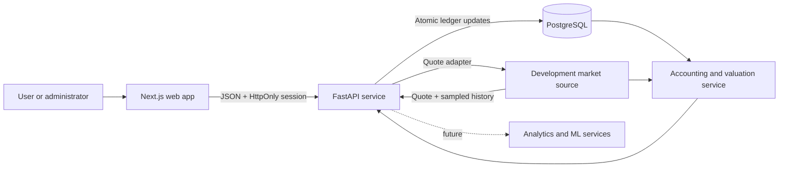
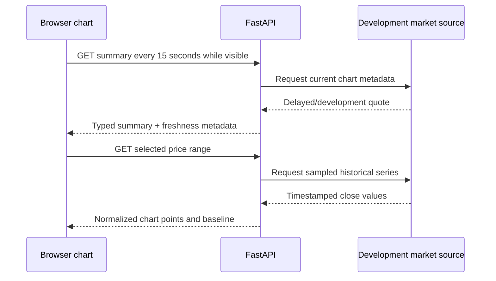
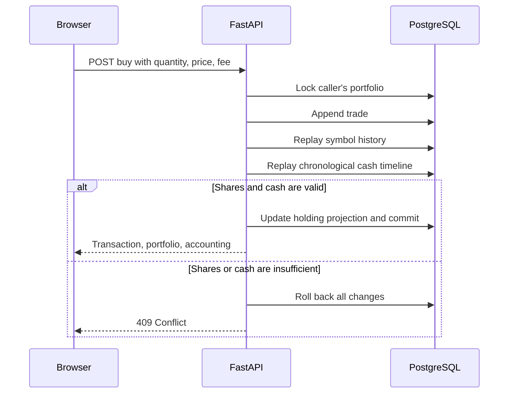
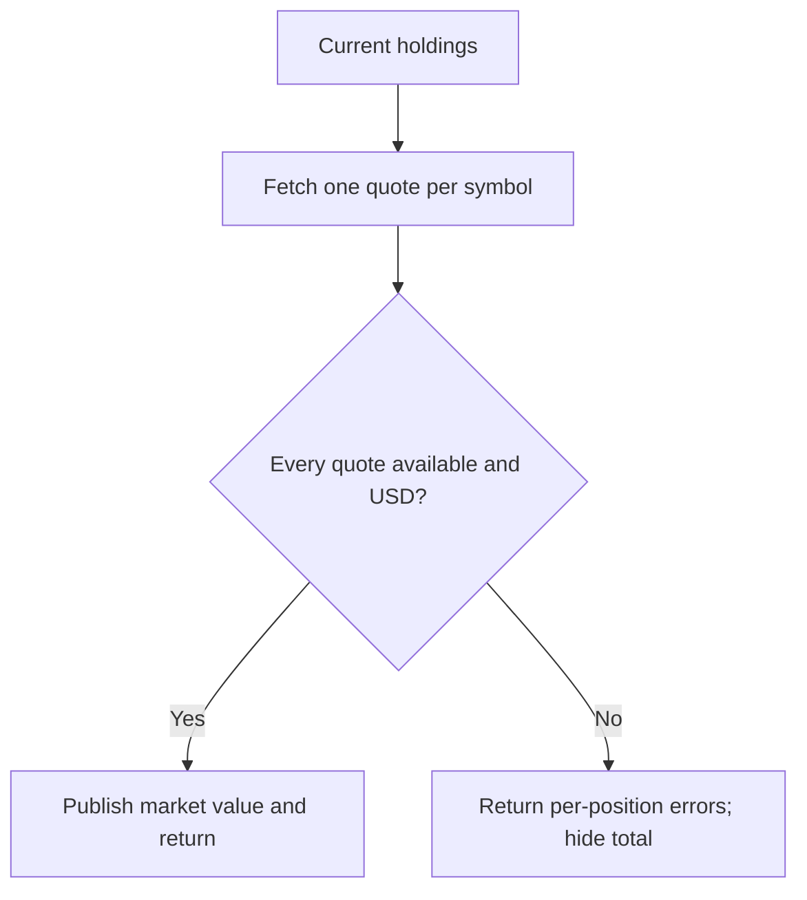

# StockAI architecture

## v0.6 system context



The trade ledger controls shares; the cash ledger controls money; holdings are a rebuildable
projection. Valuation joins the accounting state with current quotes but does not persist or alter
either ledger.

## Auto-updating research flow



This is polling, not streaming. The UI never claims tick-level real-time delivery because the
development provider offers no production service-level guarantee. `MarketDataProvider` owns both
summary and history operations so a future licensed adapter can replace the upstream source while
keeping the FastAPI and React contracts stable. A production WebSocket fan-out would live behind
the same boundary rather than exposing a vendor key to browsers.

## Funded transaction flow



Cash inflows at an identical timestamp are evaluated before purchases; sells are evaluated before
withdrawals. This deterministic priority lets migration opening funding cover a legacy purchase
at the same recorded time.

## Valuation completeness



Partial values can be more dangerous than no value: omitting an unavailable holding would make
the portfolio look smaller and distort return. v0.5 therefore exposes individual quote failures
but sets aggregate valuation and return fields to `null` unless the valuation is complete.

## Persistent model additions

```mermaid
erDiagram
  PORTFOLIO ||--o{ PORTFOLIO_TRANSACTION : records
  PORTFOLIO ||--o{ CASH_EVENT : records
  PORTFOLIO ||--o{ HOLDING : projects
  PORTFOLIO_TRANSACTION {
    string transaction_type
    string symbol
    decimal quantity
    decimal price
    decimal fee
    datetime occurred_at
  }
  CASH_EVENT {
    string event_type
    decimal amount
    string symbol nullable
    datetime occurred_at
  }
```

`deposit`, `withdrawal`, and `opening_balance` affect net contributions. `dividend` affects cash
and return but not contributions. Buy fees enter cost basis; sell fees reduce realized proceeds.

## Performance definition and limits

v0.5 uses `total value − net contributions` for since-inception dollar return. This is internally
consistent for the modeled events, but it is not time-weighted return, internal rate of return,
or tax reporting. Corporate actions, lots, shorts, margin, and currency conversion remain future work.
