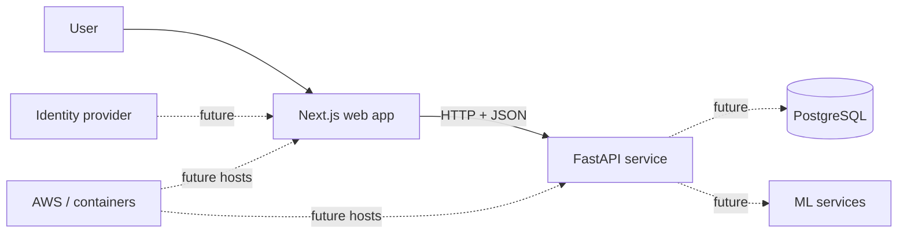

# StockAI architecture

## v0.1 system context

The only implemented runtime path is the solid line: the browser requests a typed market
summary from FastAPI. Dashed elements record intended extension points, not commitments.

## Boundaries

- `app/` owns presentation and browser interaction.
- `backend/app/` owns HTTP contracts and business logic.
- `backend/tests/` checks API behavior without starting a real server.
- `docs/` records decisions and the learning trail.

Keeping the API separate makes PostgreSQL, background jobs, authentication, and model
serving possible later without coupling those choices to the user interface.
